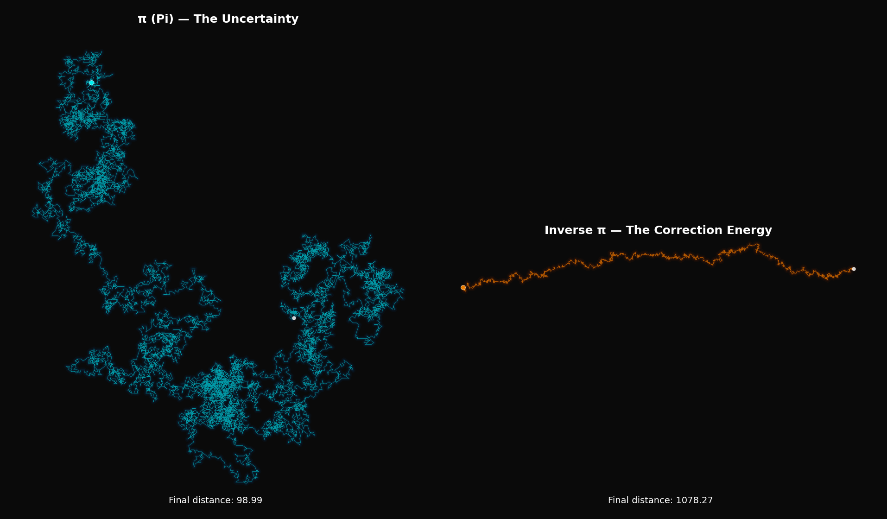
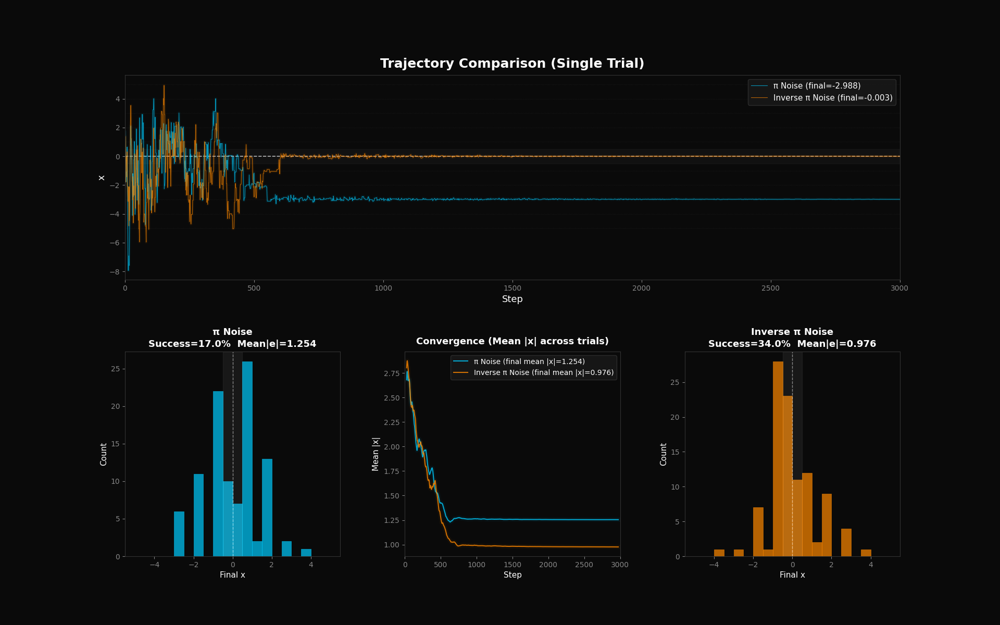

# Inverse Pi Optimizer (逆円周率オプティマイザー) 🌀

円周率 $\pi$ の各桁を「10の補数」に反転させた「逆円周率（Inverse $\pi$）」の概念を用い、「**ゼロ（完全な静止）が存在しない非対称ノイズ**」が、最適化アルゴリズム（Simulated Annealing）における局所解（ローカルミニマ）からの脱出にいかに寄与するかを実証するシミュレーションプロジェクトです。

## 📖 詳しい解説 (Zenn Article)
本プロジェクトの哲学的な背景とアルゴリズムの解説は、以下のZenn記事をご覧ください。
[【Python】不可解な「逆円周率ノイズ」を、局所解からAIを救うアテにする](https://zenn.dev/cocoa3j21/articles/b72a764450e23a)

## 🚀 収録スクリプトと実行結果

### 1. 軌跡のシミュレーション (`anti_circle_generator.py`)
円周率（0〜9）と逆円周率（1〜10）を極座標の角度ベクトルとしてランダムウォークさせた軌跡を描画します。0が存在しないことによる強力なドリフト（推進力）を視覚化します。



### 2. 最適化アルゴリズムの比較 (`anti_circle_optimizer.py`)
多数のローカルミニマを持つ関数に対し、対称ノイズ（ $\pi$ ）と非対称ノイズ（逆 $\pi$ ）を用いた焼きなまし法（SA）を実行し、大域的最適解への到達率を比較します。



## 🛠️ 環境構築と実行方法

```bash
# リポジトリのクローン
git clone https://github.com/cocoa3j21/inverse-pi-optimizer.git
cd inverse-pi-optimizer

# 依存ライブラリのインストール
pip install mpmath numpy matplotlib

# スクリプトの実行
python anti_circle_generator.py
python anti_circle_optimizer.py
```

## ☕ Support
もしこの「天才的な技術の無駄遣い（思考実験）」を楽しんでいただけたら、深夜のコーディングの励みになるカフェ代を支援していただけると嬉しいです！
[Buy cocoa3j21 a coffee ☕](https://www.buymeacoffee.com/cocoa3j21)

## 📜 License
MIT License
